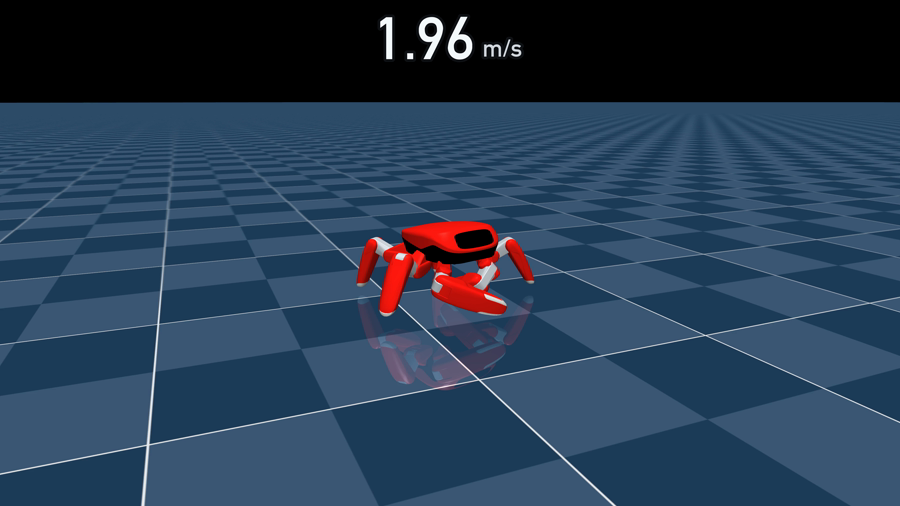
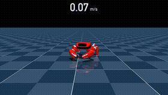

# JumperEMW

[English](README.en.md) | **简体中文**



基于 **Jumper**——一台 22 自由度、3D 打印的螃蟹机器人——的个人实验：
在 MuJoCo 里做强化学习动作训练，每个实验都有记录、可复现、全开源。

这是[电磁波 studio](https://github.com/emwstudio) 的个人实验仓库，
不是 KingKong Robotics 的官方发布。仓库建立在开源的
[Jumper 训练仓库](https://github.com/KingKongRobotics/jumper)之上，
上游的历史与归属完整保留在本仓库的 git 历史中。

<br clear="right">

## 实验

表格中的动图会直接播放，点击可打开完整视频。所有结果均为仿真回放，真机验证尚未进行。

<table>
  <thead>
    <tr>
      <th>实验</th>
      <th>预览</th>
      <th>结果</th>
    </tr>
  </thead>
  <tbody>
    <tr>
      <td><strong>极速奔跑</strong></td>
      <td>
        <a href="docs/media/run-top-speed.mp4">
          
        </a>
      </td>
      <td>
        速度跟踪策略在 2.0 m/s 固定指令下：峰值 <strong>2.15 m/s</strong>，
        平滑读数 2.03 m/s，五次 10 秒连续奔跑零摔倒。画面顶部叠加的速度表，
        与 <code>play</code> 窗口中的实时速度显示完全一致。<br>
        <a href="docs/media/run-top-speed.mp4">完整视频（4K）</a> ·
        <a href="docs/TUTORIAL.zh.md">训练教程</a>
      </td>
    </tr>
  </tbody>
</table>

## 快速上手

需要 Python 3.10–3.13。NVIDIA 显卡机器安装 GPU 版 PyTorch；
其他机器安装 CPU 版并选用 native 后端。

```bash
git clone https://github.com/emwstudio/JumperEMW.git
cd JumperEMW
python3 -m venv .venv && source .venv/bin/activate
pip install torch torchvision --index-url https://download.pytorch.org/whl/cu128
pip install -e .

python scripts/train.py --list
python scripts/train.py --task jumper.run
python scripts/play.py --task jumper.run --checkpoint <路径>/model_9999.pt
```

play 窗口是可以上手玩的：按 **W** 前进，**Backspace** 重置，
顶部挂着同款实时速度表。从训练到打包的完整流程见
[训练教程](docs/TUTORIAL.zh.md)；Linux、macOS、Windows 的安装细节见
[项目指南](docs/PROJECT_GUIDE.zh.md)。

## 仓库结构

```text
tasks/jumper/run/      冲刺任务：环境配置、奖励项、操控
tasks/jumper/          上游的步态、舞蹈、手势等任务
rl/mjrl/               训练支撑代码与实时 play 窗口
scripts/               训练、试玩、导出、部署
deploy/                从 checkpoint 到真机：动作包、RKNN、各宿主端
docs/                  手册与指南，中英双语
tests/                 守护以上一切的测试套件
```

## 范围说明

这些是仿真实验，不是真机安全认证。2.15 m/s 是平地上的仿真成绩，
真机还没有跑过。真机跑出结果后，会在这里汇报。

## 上游与许可

Jumper 产品仓库在
[KingKongRobotics/jumper](https://github.com/KingKongRobotics/jumper)；
外观与场景创作使用独立的
[jumper-design](https://github.com/KingKongRobotics/jumper-design) 仓库。

Copyright 2026 KingKong Robotics。维护者拥有权利的项目内容采用 Apache-2.0，
详见 [LICENSE](LICENSE) 与 [NOTICE](NOTICE)。第三方内容保留其各自的许可条款。
本仓库新增的实验与文档采用相同许可。
